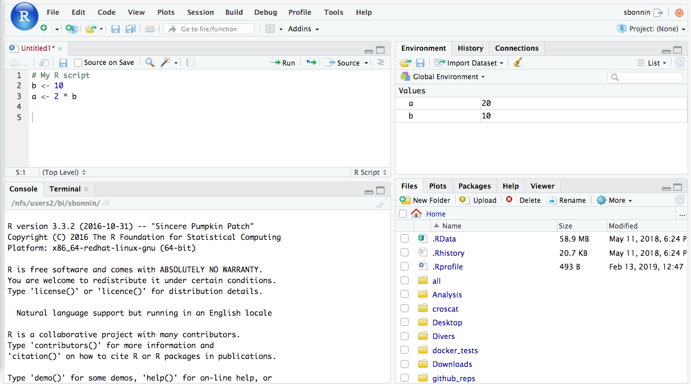
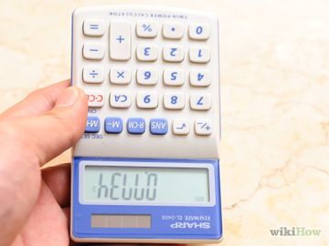
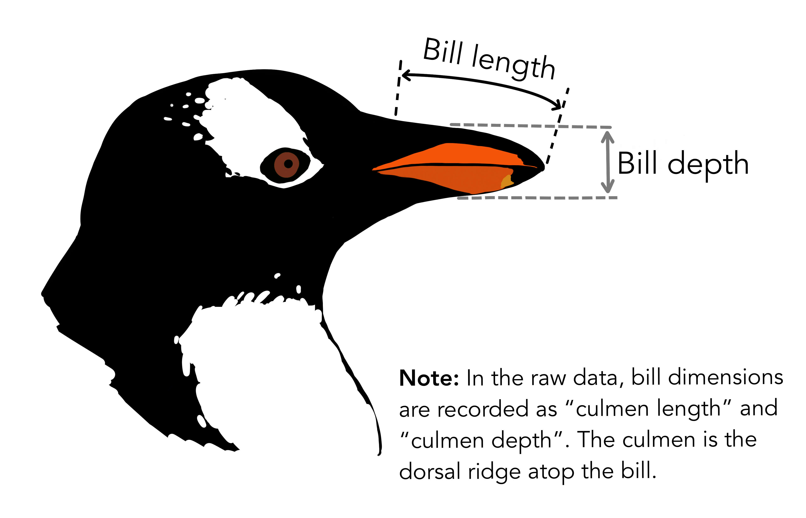
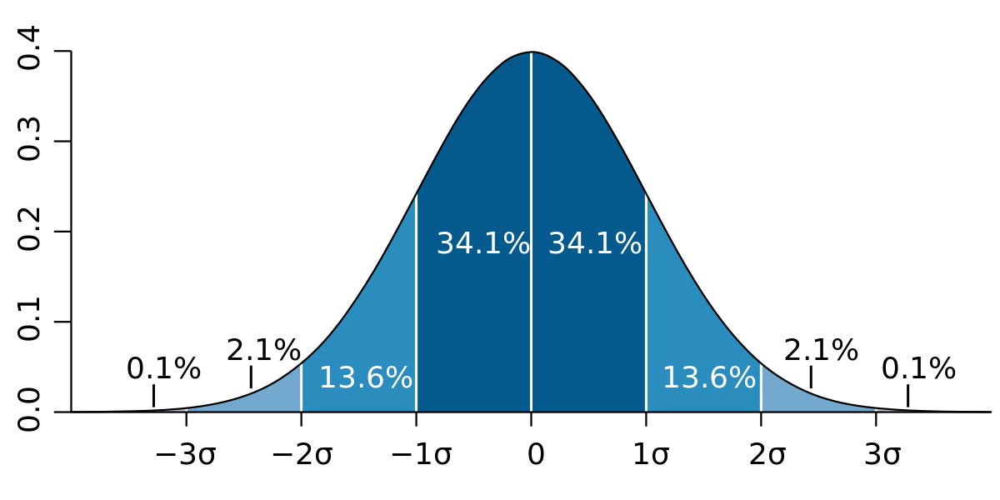
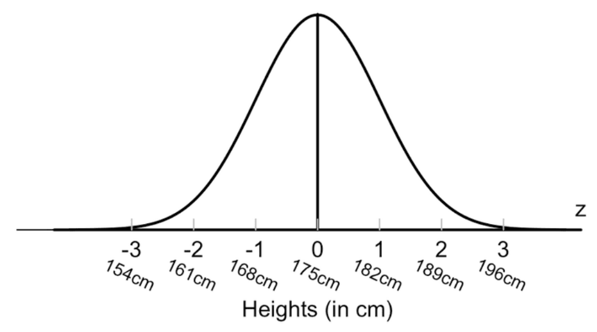

  
  ```{r setup, include=FALSE}
knitr::opts_chunk$set(echo = TRUE)
```

## Introduction

The objective of this workshop is to introduce statistics and data analysis using the R programming language. We will start by exploring what R is and to use it as a calculator, then we will analyse the *penguins* dataset.

### The Rstudio interface

Throughout this workshop, we will Rstudio. Rstudio is an *integrated development environment*, a software that includes everything we need to use R comfortably. Here's a overview of the interface.



<br>

The Rstudio interface you have in front of you is divided in 4 parts:\

1.  Upper left: the script area. Here you can write several lines of code. To execute a bit of code written here, either select it and click on Run, or click on the line and press Ctrl + ↵

2.  Lower left: the is the R console. Here can enter single commands. All executed commands (including those ran from the scipt area) will be sent here, and R responses will be displayed here.

3.  Upper right: the environment panel. In this panel. This shows everything that has already been stored in the environment: data, variables, ...

4.  Lower right: file browser, plots, help on functions, ...

<br>

### Files and working directory

All the necessary files are included in the folder we've provided to you, called `StatsWorkshop`.
We will work inside this folder and define it as our *working directory*, 
meaning that everything that we will generate and read will be from this place.
Using the Files panel in Rstudio, navigate to inside this folder. 
Then click on "More" on the top of this panel, then "Set as working directory".
You will notice that a command has appeared in the console panel:
clicking on set as working directory has instructed Rstudio to run a `setwd` command. 
This is in fact another way to set the working directory, by executing a command `setwd("PATH/TO/THE/DIRECTORY")`.
If we want a reminder of where R is currently working, we can request to know the working directory with the command `getwd()`.

<br>
  
## Module 1: R as a calculator and programming basics



<br>In this module, we will see how we can use R as a (quite powerful) calculator and learn some basics of coding in R that will be necessary for the rest of the workshop.

$$
\\[1cm]
$$

### 1.1. Basic Operations

The console of R can be used as a basic calculator. For example, we can type the following commands, and R will compute and display the result.

```{r calculator1}
3+2
2+3*5
(2+3)*5
42*123
(15+3)/(143.7-17)
2^11
```

<br>R also knows standard function like square root (`sqrt`), exponential (`exp`) or base 10 logarithm (`log10`).

```{r calculator5}
sqrt(125)
exp(10)
log10(1000)
```

#### Exercise 1

What are the values of the following?

$$
log_{10}\left(9+{{2+3}\over{10-5}}\right)
$$

$$
\sqrt{5^3 + 3 \times 7 - 2}
$$

*When you are ready to see the answer, click on the "Code" button on the right below this.*

```{r correction1, class.source = 'fold-hide', collapse=TRUE}
log10(9+(2+3)/(10-5))
sqrt(5^3+3*7-2)
```

$$
\\[1cm]
$$

### 1.2. Variables

R can store values in *variables*. They are assigned using the symbol `<-`.

```{r variables}
a <- 3
b <- 5
a*b
```

<br>Variables can be overwritten:

```{r overwriteVars}
a <- 42
b <- a-40
a
b
a <- 3
a
b
```

Note that in the above example, overwriting `a` did not change the value of `b`: R does not go back to rerun older lines of code!

<br>You can name your variables with whatever name you want, with a few exceptions that are protected names. Do not hesitate to give long, clear names to your variables. R is a case-sensitive language, which means that `thisvariable`, `ThisVariable` and `THISVARIABLE` will all be considered to be different names.

Importantly, variables can have different types. Such types include:

-   Integer, *e.g.* `3`

-   Numeric, *e.g.* `-3.14`

-   Character, *e.g.* `"This is a character"`. They are defined between quotes, either `"double"` or `'simple'`.

-   Logical, being either `TRUE` or `FALSE`. We will cover these in more details in the next section.

There are other types, but these will be the most frequent ones. Note that not all operations are possible on all types:

```{r additionCharacters, error = TRUE}
character1 <- "Trying to"
character2 <- "add characters."
character1 + character2
```

<br>*Note: if you want to concatenate characters, the function to do so is called* `paste`*:*

```{r paste}
character1 <- "Pasting characters"
character2 <- "works much better."
paste(character1, character2)
```

<br>We will often need not only one value, but a set of values. To do so, we can create *vectors* using `c()`. The `i`-th value in the vector `v` can be accessed using `v[i]`.

```{r}
v <- c(1,3,5,7,9)
v

v[3]
```

<br>Vectors can contain any type of variable. However, they can only contain variables that are from the same type. If you want to group variables of different types, you need to use a structure called *lists*, but we do not have the time to cover them in this workshop.

Special case: if you want all integer values between two numbers, there is a shortcut: `start:end`.

```{r}
numberSequence <- 3:103
numberSequence
```

$$
\\[1cm]
$$

### 1.3. Logical and 'if' statement

We can create some variables that are called *logical* or *booleans*. This means that they can take only two values: `TRUE` or `FALSE`, sometimes coded as 1 and 0. These names are protected in R so you cannot override them by creating a variable with these names. There are specific operations that we can make on logical variables:

-   **x AND y** returns TRUE if both x and y are TRUE, returns FALSE otherwise

-   **x OR y** returns TRUE if at least one of x or y is TRUE, returns FALSE if both x and y are FALSE

-   **NOT x** returns the opposite of x: FALSE if is TRUE, TRUE if x is FALSE

In R, AND is coded by `&`, OR is coded by `|` (above the `\` symbol on the keyboard) and not is coded by `!`.

```{r logicalExample}
t <- TRUE
f <- FALSE
t & f
t | f
!t
!f
```

<br>

#### Exercise 2

with t being defined as `TRUE` and f as `FALSE` (as above), what do the following evaluate to?

t AND NOT f

NOT (t OR f)

((NOT t) OR f) AND t

Before you evaluate them in R, try to see if you can figure them out by yourself.

*When you are ready to see the answer, click on the "Code" button on the right below this.*

```{r correction2, class.source = 'fold-hide', collapse=TRUE}
t <- TRUE
f <- FALSE
t & !f
!(t | f)
((!t) | f) & t
```

We can evaluate whether two variable have the same value with `==` or if they are different with `!=`. These operations return logical values:

```{r}
a <- 3
a == 5
b <- 7
a != b
```

<br>The logical variables can be used to run bits of code only when a certain condition is met. To do so, we can use the `if() else` structure:

```{r, eval=FALSE}
if(CONDITION){*CODE TO RUN IF THE CONDITION IS MET*} else{*CODE TO RUN IF THE CONDITION IS NOT MET*}
```

Note that the `else{}` statement is optional, and we can remove it if we don not need anything to be done if the condition is not met. Here is an example:

```{r}
a <- 10
if(a==10){print("a is 10")} else{print("a is not 10")}

a <- 5
if(a==10){print("a is 10")} else{print("a is not 10")}

a <- 3
if(a > 2){a = a-1}
a

v = c( 12, 46, 89,3, 8)
if (v[4]== 5) {
  print("v[4] equals 5")
} else {
  print("v[4] is not 5")
  }

```

$$
\\[1cm]
$$

### 1.4. Loops

When we need a part of the code to be run several times, there is no need to copy and paste the same chunk of code several times (imagine if you need to run it 100,000 times!). There are structures called *loops*. The most frequent one is the for loop, which follows this structure:

```{r, eval=FALSE}
for(variable in SET OF VALUES){
  CODE TO BE RUN MULTIPLE TIMES,
  ONE FOR EACH VALUE IN SET OF VALUES
  THIS CODE CAN USE variables
}
```

<br>Here are a few examples:

```{r}
for(a in c(1,3,5,7,9)){
  print(a)
}

count <- 0
for(loop in 1:10){
  count <- count +1
}
count

sentence <- ""
for(word in c("One","word","at","a","time.")){
  sentence <- paste(sentence,word)
}
sentence
```

<br>

#### Exercise 3

Write a loop that prints every number form 1 to 15 but that replaces 3 and 9 by `"foo"` and 5 and 10 by `"bar"`, giving the following output:

```{r, echo=FALSE}
for(number in 1:15){ # loop on all numbers from 1 to 15
  toPrint <- number # by default, we will need to print the number we are at
  if(number == 3 | number == 9){toPrint <- "foo"} # replace 3 and 9 by "foo"
  if(number == 5 | number == 10){toPrint <- "bar"} # replace 5 and 10 by "bar"
  print(toPrint) # print result
}


```

*When you are ready to see the answer, click on the "Code" button on the right below this.*

```{r, class.source = 'fold-hide', collapse=TRUE}
for(number in 1:15){ # loop on all numbers from 1 to 15
  toPrint <- number # by default, we will need to print the number we are at
  if(number == 3 | number == 9){toPrint <- "foo"} # replace 3 and 9 by "foo"
  if(number == 5 | number == 10){toPrint <- "bar"} # replace 5 and 10 by "bar"
  print(toPrint) # print result
}
```

*What will happen if you overwrite the second argument with a new one. For example, what will happen if you replace 3 and 9 by `"foo"` and 9 and 10 by `"bar"`?

```{r, class.source = 'fold-hide', collapse=TRUE}
for(number in 1:15){ # loop on all numbers from 1 to 15
  seeOnScreen <- number # by default, we will need to print the number we are at
  if(number == 3 | number == 9){seeOnScreen <- "foo"} # replace 3 and 9 by "foo"
  if(number == 9 | number == 10){seeOnScreen <- "bar"} # replace 5 and 10 by "bar"
  print(seeOnScreen) # print result
}
```


$$
\\[1cm]
$$

  
### 1.5. Packages

It is possible to expand the functions already available in R or to import new datasets using *packages*. Packages are sets of functions and/or data written by R users that can be shared and used by anyone.

They can be distributed on different sites, with slightly different installation methods. The easiest way to know is to always visit the package's webpage to look at the installation instruction.

For packages distributed through CRAN (the organism responsible for R development), you can install packages using `install.packages("nameOfThePackage")`. During the workshop we will use functions from the packages `tidyr`, `palmerpenguins` and `factoMineR`. To install them, run the following:

```{r, eval=FALSE}
install.packages("tidyr")
install.packages("psych")
install.packages("dplyr")
install.packages("ggplot2")
install.packages("palmerpenguins")
install.packages("FactoMineR")
```

<br>This will install these packages on your computer. They need to be loaded with `library()` to be usable in the R session:

```{r}
library(tidyr)
library(palmerpenguins)
library(ggplot2)
library(FactoMineR)
```


In case you do not know how to use a package, or need further information about it, you can use the help function. 
?? followed by a package name gives you access to vignettes, code demonstrations and help pages in the lower right panel.

```{r}
help(package = "ggplot2")

??ggplot2
```


$$
\\[3cm]
$$

## Module 2: First look at the penguins


<br> During the rest of the workshop, we will analyze an example dataset, that lists measurements of penguins observed in the Palmer Archipelago (Antarctica) by Dr Kristen Gorman (University of Alaska). For each animal included in the dataset, we have access to:

-   Its species

-   The island it was observed on

-   The length and depth of it bill (see illustration below)

-   Its flipper length

-   Its body mass

-   Its sex

-   The year it was observed




$$
\\[1cm]
$$

  
### 2.1. Reading and writing data

The first step to access and analyse a dataset is to load it into the R environment. We provided you with the palmerpenguins dataset as a `.csv` file. This is a text format to represent a table where cells are separated by a comma. To load data from a .csv file into the R environment, we will use the `read.table()` function:

```{r,eval=FALSE}
penguins <- read.table("PATH/penguins.csv",sep = ",", header = T)
```

```{r, echo=FALSE}
penguins <- read.table("penguins.csv",sep = ",", header = T)
```

Don't forget to adjust the path to the file to allow R to find it. the `sep` argument specifies what was used to separate the table cells. The `header` parameter tells R that the first line contains headers, i.e. column names.

We stored it in a variable called penguins. Its structure is different from other variables: this a table, called a *data frame*. Each individual penguin is on a different line, and each column is a different information on all penguins.

To check everything went well, we can have a look at the first few lines of the data frame:

```{r}
head(penguins)
```

This prints the first few lines. You will notice that some data are labeled as NA. This means that this information is missing, something that happens more often than you would think in real life datasets! R encodes this with a special value `NA`.

$$
\\[1cm]
$$

### 2.2. Summary of the data

To have a quick look at what is in the dataset, we can use the `summary()` function:

```{r}
summary(penguins)
```

<br>Descriptive statistics may be a long gone memory, so here's a reminder:

-   Median is the value that splits the set in 2 halves of the same size. For example, the median body weight of our penguins is 4202g. This means that 50% of penguins have a body mass below or equal to 4202g, and 50% have a body mass above or equal to 4202g.

-   1st and 3rd quartiles are the values that split the set at 25% and 75%, respectively.

<br>

To have a more complete summary of the data, we can also use the function `describe()` from the package `psych`:

```{r, echo=T, results='hide'}
library(psych)
```

```{r}
describe(penguins)
```

<br>To access one of the columns of a data frame, we can use the symbol `$`, with this syntax:

dataframe\$columnname

```{r}
penguins$species
penguins$bill_length_mm
```

<br>If we want to count data, we can use the function `table()`. We can ask it for counts of one or two variables. The `useNA` parameter is used to indicate R whether to display the number of NAs. It must be one of `"no"`, `"ifany"` or `"always"`, to respectively not show them, show them only if there are NAs, or to always show them, even if there are none. If not specified, it will default to "no". Optionnaly, we can also name the variable we want to count.

```{r}
table(penguins$sex, useNA = "ifany")
table(species = penguins$species, island = penguins$island)
```

<br>

#### Exercise 4

Using the table() function, find the answer to the following:

1.  How many penguins were observed on Dream Island?

2.  How many females were observed in 2008?

3.  How many missing entries (NAs) are there in the island column?

*When you are ready to see the answer, click on the "Code" button on the right below this.*

```{r, class.source = 'fold-hide', collapse=TRUE}
table(penguins$island)
# 124 penguins observed on Dream island
table(sex = penguins$sex, year = penguins$year)
# 56 females observed in 2008
table(penguins$island,useNA = "always")
# 0 NAs for the island column
```

$$
\\[1cm]
$$

### 2.3. Subsetting the dataset

Perhaps we don't want to look at all available penguins but maybe we are only interested in Adelie penguins. For this and many different analyses, we will need to only look at a subet of the dataset. There are several ways to do so. The first one is using the subset() function:

```{r}
adelie <- subset(penguins, species=="Adelie")
table(species = adelie$species, island = adelie$island)
```

If we want to specify several possible value, can use the constructor `%in%`:

```{r}
biscoeDream <- subset(penguins, island %in% c("Biscoe","Dream"))
table(species = adelie$species, island = adelie$island)
```

We can also put several conditions:

```{r}
malesTorgersen <- subset(penguins, island == "Torgersen" & sex == "Male")
table(sex = adelie$sex, island = adelie$island)
```


<br>

We can also specify directly which lines and/or columns to keep. To do so, we use the structure `dataframe[lines, columns]`. If either lines or columns are left empty, this means that we want to keep all lines or columns, respectively. We can specify which lines / columns to keep either by giving a vector of logicals, numbers, or names:

```{r}
subset <- penguins[penguins$island == "Biscoe", c("species","island","body_mass_g")] #keep only lines that have "Biscoe" as island, and keep only columns "species", "island" and "body_mass_g"
subset <- penguins[25:40,] # keep only lines 25 to 40, and all columns
```

<br>

Another way to subset the data is to use the `filter()` function from the package `dplyr`. It works similarly to `subset()`.

```{r, echo=T, results='hide'}
library(dplyr)
```

```{r}
adelieFemales <- filter(penguins, species == "Adelie", sex == "female")
```


To count the number of rows or columns in a dataframe we do the following:

```{r}
nrow(adelieFemales)
ncol(adelieFemales)
```

<br>

#### Exercise 5

Using `table()` or `summary()` on a subset of the penguins data frame, find out the answer to the following questions:

1.  What is the mean body weight of female Gentoo penguins?

2.  What is the smallest observed flipper length for Chinstrap penguins in 2007?

3.  How many Adelie penguins weighing less than 4,000 g were observed on Dream Island?

*When you are ready to see the answer, click on the "Code" button on the right below this.*

```{r, class.source = 'fold-hide', collapse=TRUE}
summary(subset(penguins,sex=="female" & species == "Gentoo"))
# Mean body mass: 4680g 
summary(subset(penguins,year==2007 & species == "Chinstrap"))
# Minimum flipper length: 178.8mm
table(penguins[penguins$species=="Adelie" & penguins$body_mass_g < 4000, "island"])
# 42 Adelie penguins weighing less than 4,000g on Dream island
```

$$
\\[1cm]
$$

### 2.4. Descriptive statistics

The `summary()` function allows to have a quick look at what's in our dataset, but returns many different output. We can instead directly compute descriptive statistics using the following functions:

-   `mean()` for the mean

-   `median()` for the median

-   `quantile()` for any given quantile (generalization of the quartile concept to other fractions than quarters). We indicate the quantile we want with the parameter `probs`, expressed between 0 and 1. Note that the median is equivalent to `quantile(x, probs = 0.5)`.

-   `sd()` for standard deviation, a measure of data variability

By default, all these functions will return `NA` if the data contains NAs. To ignore NAs and return descriptive statistics of the non-missing data, we can use the parameter `na.rm = TRUE`.

```{r}
mean(penguins$body_mass_g)
mean(penguins$body_mass_g, na.rm = TRUE)
median(penguins$flipper_length_mm, na.rm = TRUE)
quantile(penguins$flipper_length_mm, probs = c(0.10,0.25,0.5,0.75,0.90), na.rm = T)
sd(penguins$bill_length_mm, na.rm = TRUE)

```

<br>

Before the next exercise, let's add a new column to the dataset that will contain the bill length to depth ratio:

```{r}
penguins$bill_ratio <- penguins$bill_length_mm / penguins$bill_depth_mm
```

<br>

#### Exercise 6

1.  What is the mean and standard deviation of the body mass of Adelie penguins?

2.  What is the median flipper length of female penguin?

3.  What are the quartiles and median bill length to depth ratios for Chinstrap penguins?

*When you are ready to see the answer, click on the "Code" button on the right below this.*

```{r, class.source = 'fold-hide', collapse=TRUE}
mean(penguins[penguins$species == "Adelie","body_mass_g"], na.rm = TRUE)
sd(penguins[penguins$species == "Adelie","body_mass_g"], na.rm = TRUE)
# Mean: 3700.662, sd: 458.5661
median(penguins[penguins$sex == "female","flipper_length_mm"], na.rm = TRUE)
# Median: 193
quantile(penguins[penguins$species == "Chinstrap","bill_ratio"], probs = c(0.25,0.5,0.75), na.rm = TRUE)
# 1st quartile 2.556, median 2.662, 3rd quartile 2.728
```

$$
\\[3cm]
$$

### 2.4. Descriptive statistics

The `summary()` function allows to have a quick look at what's in our dataset, but returns many different output. We can instead directly compute descriptive statistics using the following functions:

-   `mean()` for the mean

-   `median()` for the median

-   `quantile()` for any given quantile (generalization of the quartile concept to other fractions than quarters). We indicate the quantile we want with the parameter `probs`, expressed between 0 and 1. Note that the median is equivalent to `quantile(x, probs = 0.5)`.

-   `sd()` for standard deviation, a measure of data variability

By default, all these functions will return `NA` if the data contains NAs. To ignore NAs and return descriptive statistics of the non-missing data, we can use the parameter `na.rm = TRUE`.

```{r}
mean(penguins$body_mass_g)
mean(penguins$body_mass_g, na.rm = TRUE)
median(penguins$flipper_length_mm, na.rm = TRUE)
quantile(penguins$flipper_length_mm, probs = c(0.10,0.25,0.5,0.75,0.90), na.rm = T)
sd(penguins$bill_length_mm, na.rm = TRUE)

```

<br>

Before the next exercise, let's add a new column to the dataset that will contain the bill length to depth ratio:

```{r}
penguins$bill_ratio <- penguins$bill_length_mm / penguins$bill_depth_mm
```

<br>

#### Exercise 6

1.  What is the mean and standard deviation of the body mass of Adelie penguins?

2.  What is the median flipper length of female penguin?

3.  What are the quartiles and median bill length to depth ratios for Chinstrap penguins?

*When you are ready to see the answer, click on the "Code" button on the right below this.*

```{r, class.source = 'fold-hide', collapse=TRUE}
mean(penguins[penguins$species == "Adelie","body_mass_g"], na.rm = TRUE)
sd(penguins[penguins$species == "Adelie","body_mass_g"], na.rm = TRUE)
# Mean: 3700.662, sd: 458.5661
median(penguins[penguins$sex == "female","flipper_length_mm"], na.rm = TRUE)
# Median: 193
quantile(penguins[penguins$species == "Chinstrap","bill_ratio"], probs = c(0.25,0.5,0.75), na.rm = TRUE)
# 1st quartile 2.556, median 2.662, 3rd quartile 2.728
```

$$
\\[3cm]
$$


## Module 4: Distributions and statistical tests

### 4.1. Data preparation to compare group means

We will focus on our penguins data creating subsets of them to see their distribution. We will step-by-step check the "rules" that need to be followed in order to perform different types of tests to check if they are "equal" or not. When we test for "equality" we usually check differences in the mean values of different groups in our dataset. Let's start by trying to collect the data that will be used in our analysis, by focusing on the penguins from the "Adelie" and "Gentoo" species. We start by subsetting the dataset using `filter`. You will note in this example a different structure: `|>` is called a *pipe*. It tells R to send the object specified before `|>` as the main argument of the following function. It can be used to make the code clearer to read.

```{r}
data_to_test = penguins |>
  filter(species %in% c("Adelie","Gentoo"),
         !is.na(body_mass_g))
```

Let's have a quick look of our data using the `summary()` and `describe()` functions. What is the output of these functions? What does it mean?

```{r}
summary(data_to_test)
describe(data_to_test)

```

$$
\\[1cm]
$$

### 4.2. The normal distribution



$$
\\[1cm]
$$



<br>How can we understand that our data follow the normal distribution as seen above? <br>Firstly, we can plot a histogram of our data to check how they look. In R, we do the following to draw the histograms of the body mass by species using `ggplot2`:

```{r}
ggplot(aes(x=body_mass_g), data = data_to_test) +
  geom_histogram(binwidth = 200) +
  facet_wrap(~species) +
  theme_bw()
```

<br>It seems that our data, after choosing a right bin size, follow the normal distribution, without major outliers.

Secondly, we need to check the Q-Q (quantile-quantile) plots. In normally distributed data, these plots should fall along the 1:1 line. The most simple way to do it is the following

```{r}
qqnorm(data_to_test$body_mass_g)
qqline(data_to_test$body_mass_g)
```

<br>To have a more clear picture we can vizualize two plots for each species.

```{r}
data_to_test |>
  ggplot(aes(sample = body_mass_g )) + 
  geom_qq() +
  geom_qq_line(colour ='darkred') +
  facet_wrap(~species) +
  theme_bw()
```

<br>Last but not least, we need to check that the variances of the two groups are equal. If, also the variances are equal, then we can assume that the data follow the normal distribution, and we can perform a parametric test to check for their differences. To do that we will perform the Levene's test for equality of variances. We will use the `levene_test()` function from the `rstatix` package.

```{r}
library(rstatix)
# check for equality of variance with Levene's test
data_to_test |> levene_test(body_mass_g ~ species) 
```

What is the p-value from the test? Is it less than 0.05? If the p-value is \> 0.05, it means that the variances are not significantly different.

$$
\\[1cm]
$$

### 4.3. Parametric tests and when we use them

When we want to compare the difference between two means, we conduct a t-test. In a t-test, we test the initial hypothesis (H0), that the means are equal. Practically, after conducting the t-test, we check the p-value, and if it is \< 0.05, we reject the null hypothesis, accepting an alternative hypothesis, that the means are significantly different.

There are several types of t-test, which include:

-   One-sample t-test. Here, we compare the mean of a sample to a known value. In our example, we could compare the body mass of our lovely penguins to the literature's standard.

-   Unpaired two-sample t-test Here, we compare the mean of two independent groups. In our example, we could compare the mean value of body mass of the male penguins to the female ones. Alternatively, the body mass of the body mass of the Adlie penguins can be compared to the Gentoo penguins.

-   Paired t-test This test is used to compare the mean values of two RELATED groups of samples. For example, it could be used when we compare the average weight of a sample (weight of polar bears) before and after winter.

To compare the difference of means in more than 2 samples (3 and more), the parametric test used is the One way Analysis of Variance, but it will not be covered in this workshop.

In our example, we can conclude that the data follow the normal distribution, therefore we will perform a parametric test to compare the mean value of the body mass in our two groups, Adelie and Gentoo penguins. <br>In base R we do the following:

```{r}
 t.test(data_to_test$body_mass_g ~ data_to_test$species)
```

Using the dplyr package:

```{r}
 data_to_test |>
   t_test(body_mass_g ~ species)
```

What do we conclude? Is the body mass of Adelie and Gentoo penguins significantly different?

Let's create a nice visualization that includes the graphs we created when we checked for normality, together with boxplots that show the body mass of our two groups.

```{r}

p1 = ggplot(aes(x=body_mass_g), data = data_to_test) +
  geom_histogram(binwidth = 200) +
  facet_wrap(~species) +
  theme_bw()

p2 = data_to_test |>
  ggplot(aes(sample = body_mass_g )) + 
  geom_qq() +
  geom_qq_line(colour ='darkred') +
  facet_wrap(~species) +
  theme_bw()

p3 = data_to_test |>
  ggplot(aes(x = species,
             y = body_mass_g)) +
  geom_boxplot(aes(fill = species)) +
  scale_fill_manual(values = c("darkorange","cyan4")) +
  geom_jitter( alpha =0.5) +
  theme_bw()


library(patchwork)
p1/ p2 | p3

```

<br>The previous was an example of an unpaired two-sample t-test. <br> But let's also perform a one sample t-test where we will compare the body mass of penguins, regardless the island the come from, to the literature's standard body mass of penguins in Antarctica, which is 3700kg.

```{r}
t.test(penguins$body_mass_g, mu = 3700, alternative = "two.sided")

```

Does the body mass of our sample's data significantly differ from the literature's standard value? If, instead of 3700, we compare the body mass of the penguins' dataset to 4200, what would be your conclusion? Would it be the same? $$
\\[1cm]
$$

### 4.4. Non-parametric tests and when we use them

When our data are not "normal" (normally distributed), instead of a parametric test we use a non-parametric alternative. More specifically, a non-parametric test does not assume anything about the underlying distribution of our data.

In our example, in case we haven't performed a 'normality' check, we can perform a Mann-Whitney U test, which is the non-parametric alternative to the unpaired t-test.

```{r}
wilcox.test(data_to_test$body_mass_g ~ data_to_test$species, paired = FALSE)

```

$$
\\[1cm]
$$ <br>

#### Exercise 10

Check if the the flipper length of female penguins is different from the male ones. Don't forget to first check for normality!

*When you are ready to see the answer, click on the "Code" button on the right below this.*

```{r, class.source = 'fold-hide', collapse=TRUE, fig.show='hide'}
#subset the data
male_female = penguins |> 
  filter(sex %in% c("male","female"),
         !is.na(flipper_length_mm))
#perform an exploratory analysis
summary(male_female)
#check for data normality
#plot histogram of values with different bin sizes
ggplot(aes(x=flipper_length_mm), data = male_female) +
  geom_histogram() +
  facet_wrap(~sex)

# The distribution does not look like a normal curve

#Q-Q plots
male_female |>
  ggplot(aes(sample = flipper_length_mm )) + 
  geom_qq() +
  geom_qq_line(colour ='darkred') +
  facet_wrap(~sex)

# Q-Q plots do not follow a line

#perform Levene's test
library(rstatix)
# check for equality of variance with Levene's test
male_female |> levene_test(flipper_length_mm ~ sex) 

# p < 0.05, which means that the variances are significantly different


## It seems that for this comparison we need to use a non-parametric test. Let's do a Mann-Whitney!

wilcox.test(male_female$flipper_length_mm ~ male_female$sex)


# We can conclude that females' flip length is different from the males one.
```

<br>

What happens when we are comparing between more than 2 groups? For parametric testing, we would perform one-way analysis of variance (ANOVA), which we will not cover during this workshop. For non-parametric test, we will use the Kruskal-Wallis test. For instance, let's see if the bill length is significantly different between islands:

```{r}
kruskal.test(penguins$bill_length_mm ~ penguins$island)
```

<br>Since the p-value is \< 0.05, we can conclude that the bill length of penguins is significantly different depending on the islands. We can visualise the data as well:

```{r}
penguins |>
  ggplot(aes(x = island,
             y = bill_length_mm)) +
  geom_boxplot(aes(fill = island)) +
  scale_fill_brewer(palette = "Set1") +
  labs(title = "Bill length by island", x = "Island", y = "Bill length (mm)") +
  theme_bw()

```

#### Exercise 11

Using a non-parametric test, determine if the flipper length is significantly between the three species. Either using the base `boxplot` function or using `ggplot2`, draw a boxplot to visualise the data.

*When you are ready to see the answer, click on the "Code" button on the right below this.*

```{r, class.source = 'fold-hide', collapse=TRUE}
kruskal.test(penguins$flipper_length_mm ~ penguins$species)

boxplot(penguins$flipper_length_mm ~ penguins$species, xlab = "Species", ylab = "Flipper length (mm)", main = "Flipper length by species", col = c("darkorange","purple","cyan4"))
```

$$
\\[1cm]
$$

### 4.5. When do you use which test?

The following table will help you to decide which statistical test to use based on your data:

```{r,echo=FALSE, collapse=TRUE, message=FALSE}
library(huxtable)

ht = hux(
  "n  of Groups to compare" = c("Two (unpaired)","Two (paired)","Three or more"),
  "Parametric Test" = c("Un-paired t-test", "Paired t-test", "One way Analysis of Variance"),
  "Non-parametric test" = c("Mann-Whitney", "Wilcoxon Rank sum", "Kruskal-Wallis"),
  add_colnames = TRUE
)

bold(ht)[1,]           <- TRUE
bottom_border(ht)[1,]  <- 0.4
align(ht)[,2]          <- "right"
right_padding(ht)      <- 10
left_padding(ht)       <- 10
width(ht)              <- 0.35
number_format(ht)      <- 2

ht
```

$$
\\[3cm]
$$

## Module 5: Principal Components Analysis and Clustering

### 5.1. Principal Component Analysis

PCA (Principal Component Analysis) is a dimensionality-reducction method, which is used to reduce the dimensionality of very large datasets.
<br> It transforms a large set of variables in to a smaller one that retains most of the information of a complex dataset.


```{r}
penguins <- read.table("<path/to/file>",sep = ",", header = T)
penguins = na.omit(penguins)
#subset data with numerical values to be used in the PCA analysis.
# One way to do this, is by using the subset function
PCA.data =  subset(penguins, select = c("bill_length_mm","bill_depth_mm","flipper_length_mm" ,"body_mass_g"))

#another way to do  it is by using the dplyr package
library(dplyr)
PCA.dplyr = penguins |> select(bill_length_mm, bill_depth_mm, flipper_length_mm, body_mass_g)

#Next step is to remove any NA values
#PCA.data = na.omit(PCA.data)
PCA.dplyr = na.omit(PCA.dplyr)

#next we will perform the PCA analysis using the prcomp function, and summarise the results
PCA.results = prcomp(PCA.data, center = TRUE, scale = TRUE)
summary(PCA.results)
plot(PCA.results)
biplot(PCA.results)
plot(PCA.results$x[,1], PCA.results$x[,2])
#plot results
library(ggfortify)
autoplot(PCA.results)
autoplot(PCA.results, data = penguins, colour = 'species')
         
#another way to perform the PCA analysis is by using functions from the factorextra and factorminer packages
library(factoextra)
library(FactoMineR)
PCA.results2 = PCA(PCA.data, graph = T)

fviz_screeplot(PCA.results2)
```

$$
\\[1cm]
$$

### 5.2. What is clustering?

Consider clustering a task in which data points are divided into  a number of groups such as the points of a group are more similar to each other than the ones that participate in different groups.
<br> In other words, clustering seperates points/groups with similar attributes, from the ones that have different characteristics and assigns them into clusters.
<br> Various types of clustering include:

1. Centroid-based clustering (k-means)

2. Density-based clustering

3. Distribution-based clustering

4. Hierarchical clustering

  
$$
\\[1cm]
$$

### 5.3. k-means clustering

k-means clustering is considered one of the simplest clustering algorithms, that groups together certain data with a member of that certain group than with another group. "k" is the number of groups that we cluster our data points, while "mean" refers to the center of the data in that group.
```{r}
#prepare the data for which we want to perform the clustering
#k.data = penguins |> na.omit(penguins) |> select(bill_length_mm, bill_depth_mm, flipper_length_mm, body_mass_g, species) |> scale()
penguins.clean = na.omit(penguins)

#run k-means clustering for different k's and visualise it

k3 <- kmeans(penguins.clean[,3:6], centers = 3)

# put en extra column at the k.data, which will show the cluster it is assigned
k3.penguinData = data.frame(cluster = k3$cluster, penguins.clean)

#In which cluster to the different species belong
ggplot(k3.penguinData, aes(x = cluster)) +
  geom_bar(aes(fill = species)) +
  theme_bw()

ggplot(k3.penguinData, aes(x = cluster)) +
  geom_bar(aes(fill = island)) +
  theme_bw()

k2 <- kmeans(penguins.clean[,3:6], centers = 2)
k4 <- kmeans(penguins.clean[,3:6], centers = 4)

# we will use factoextra package to compute the ideal number of k  and visualize the clusters

plot_k3 = fviz_cluster(k3, geom = "point", data = penguins.clean[,3:6])
plot_k2 = fviz_cluster(k2, geom = "point", data = penguins.clean[,3:6])
plot_k4 =  fviz_cluster(k4, geom = "point", data = penguins.clean[,3:6])
plot_k3
plot_k2
plot_k4


#calculate the optimal number of k's
# Elbow method
fviz_nbclust(penguins.clean[,3:6], kmeans, method = "wss")
# Silhouette
fviz_nbclust(penguins.clean[,3:6], kmeans, method = "silhouette")

```
$$
\\[1cm]
$$

### 5.4. Hierarchical clustering

Hierarchical clustering is a technique that can be divided into two categories:

1. Agglomerative hierarchical clustering (commonly used)

Here, iniatially data points are considered an individual cluster, and at each iteration, similar clusters (data points) are merged together with other similar clusters  until one cluster remains.

2. Divisive hierarchical clustering

Here, this technique considers all the data points a single cluster, and in each iteration, data points are seperated from the cluster, which are not similar. This is a procedure that continues till we are left with n number of clusters.

To visualize hierarchical clustering, we use dendrograms, which are tree-like diagrams. In these, the sequences of merges or splits is recorded.


```{r}
#prepare our dataset, removing NA values
penguins <- penguins |> filter(!is.na(bill_length_mm), !is.na(bill_depth_mm), !is.na(flipper_length_mm), !is.na(body_mass_g))

#extract the trait( variable/ -s), which will be used for te hierarchical clustering
pingu <- penguins |> select(bill_length_mm, body_mass_g)

##scale data and compute a distance matrix for them
pingu_scaled.distMatrix <- dist(scale(pingu))

#we can use different linkage types
complete.hclust <- hclust(pingu_scaled.distMatrix, method = "complete")
average.hclust <- hclust(pingu_scaled.distMatrix, method = "average")

plot(complete.hclust)
plot(average.hclust, labels = penguins$species, cex =0.2)

```
$$
\\[1cm]
$$

### 5.5. Visualisation on a heatmap

Heatmaps are graphical representations of data, which  use a color-code to represent their different values. The variation of colors is analogous to the intensity of the data values, and they are used to visually inform the reader about a phenomenon.
<br> They are commonly used in biomedical research.

```{r}
expr.data <- read.table("<PATH_TO_RNAseq_Data>", sep = ",", header = T)
rownames(expr.data) = expr.data[,1]
#expr.data = as.matrix(expr.data[,-1])
expr.data = as.matrix(expr.data[,2:ncol(expr.data)])
heatmap(expr.data, scale = "none")
heatmap(expr.data, scale = "row")
library(pheatmap)
library(RColorBrewer)
pheatmap(expr.data, fontsize_row = 5)

pheatmap(expr.data, color = colorRampPalette(rev(brewer.pal(n=10, name="RdBu"))) (100), 
         border_color = "grey60", scale="row", 
         cellwidth = 20, cellheight = 5, 
         cluster_rows = TRUE, cluster_cols = TRUE, 
         show_colnames = TRUE, show_rownames = TRUE,
         fontsize_row = 5, fontsize_col = 10, fontsize = 10, na_col= "black", legend = TRUE)

#heatmap(expr.data, scale = "column")

```
  
  
  
  
  
  